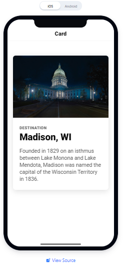
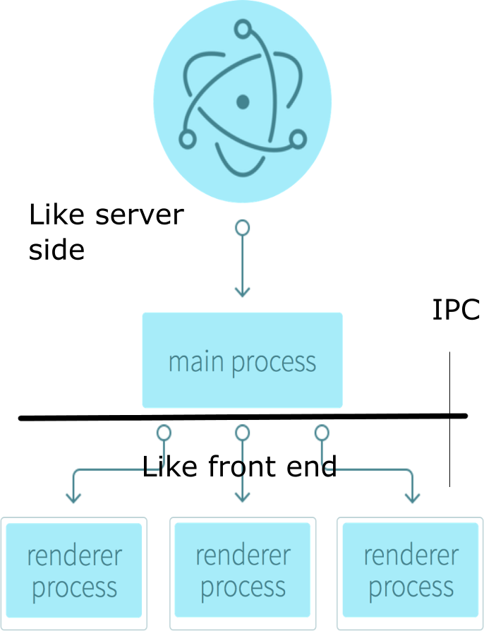

# ECMAScript is not just for the web

Javascript originated in 1995 for the popular NetScape browser. NetScape partnered with Sun to prevent Microsoft from monopolizing the browser market with its Interenet Explorer. It became an ECMA (European Computer Manufacturers Association) standard in 1997 and has evolved from the early ECMAScript 1 to  ECMScript 2015 or ES6 or Typescript.

The original intent of Javascript was as a scripting language for use in browsers, which were applications that provided the front end GUI on any platform. This inherent feature of ECMAScript made it an ideal candidate for creating platform agnostic applications on and off the web.

So, besides the web, ECMAScript family of languages can be used to create:
1. **mobile applications**
2. **desktop applications**
3. **game development**
4. **and even command line applications**

## 1. Mobile applications
There are a number of hybrid mobile application frameworks available on the market which leverage the Webview in a mobile device, that works with HTML5, CSS and Javascript. Developers write to one single code base and the apps would look and work the same way on both Android and iOS devices. One easy to learn codebase, that works on the 2 most popular mobile platforms! While they may not be as performant as a native application, the reduced lead time to enter the market, is the most attractive part of the hybrid mobile frameworks. The most widely used are Ionic, Flutter and React Native.

### 1.1 Ionic
[Ionic](https://ionicframework.com/docs/) is an open source framework that leverages the power of Angular, React and Vue(in the near future).
The apps can accesses the device's native capabilities via many community or paid(premium) plugins.

For example, there are plugins that can use the devices camera or screen orientation or cause the device to vibrate. Typically, the code accesses these features via the Application Programming Interface(API) of the plugin device.
Plugins are installed via [Cordova](https://cordova.apache.org/) or [Capacitor](https://capacitor.ionicframework.com/).

Ionic has many built in UI components that help quickly construct an UI for the app and the interactions can be customized using the APIs for the components. Scaffolding and starting an app is easily done via a Command Line Interface(CLI).

**Sample Ionic App**

### 1.2 React Native
React Native is one of the most popular mobile app development framework, and it was developed by Facebook.
It uses the React library to help build pretty user interfaces, using React components. The components have to be styled by the developer.

React and React Native use JSX, a syntax that allows us to write nested elements in Javascript. Similarly, components can be nested to create custom components.

The basic building block of React Native is a view that displays content like text, images and other form controls. Its possible to nest the views and create more complex layouts.

**Comparison of views using React core components**

If we do not care about a native look and feel, then we can use the core React components in a write once, use anywhere fashion. But if we wish to present the native look and feel, then there are different React Native components for Android and iOS.

The native components are not interchangeable; hence, its not an adaptable framework for native look and feel. But since its one of the most popular, there is extensive support from its user community, with plenty of third party packages available to fill in the functionality gaps.

In terms of popularity, React Native wins hands down.

But both Ionic and React Native, have some stiff competition against Flutter by Google. Flutter is based on the language Dart developed by Google.

## 2.0 Desktop applications

Like cross platform mobile applications, desktop applications that can be rapidly deployed on any platform is a game changer for many companies.

The most popular among them is [Electron](https://www.electronjs.org/) which is open source and backed by GitHub. Electron has been used to create many popular desktop tools like Slack, Atom, WhatsApp to name a few. Here's a link to an exhaustive list of apps that have been developed - https://www.electronjs.org/apps. The ElectronJS project has a very active and vibrant community that has popularized this framework.

ElectronJS uses [Chromium](https://www.chromium.org/) which is the open source browser project used to build Google Chrome.

Architecture - ElectronJS App has a single Main Process that executes the Javascript that can create and run multiple Renderer Processes which are akin to multiple web pages running in its own process.  Communication between the Main and Renderer process is through an ipcMain module and ipcRenderer module.

The ipcMain process is analogous to server side code in a web application and the ipcRenderer is similar in behavior to the GUI front end of a web application. Hence the ipcRenderer processes, typically cannot directly access the local file system and other resources. So an Inter Process Communication is required for the processes to interact.

**ElectronJS Architecture**

## 3.0 Game development
With the increase in speeds and capabilities of the client hardware and browser, there are a number of Game Development engines for Javascript. These typically take advantage of the Javascript WebGL Application Programming Interface(API) to render complex 2D and #D graphics for gaming.

Two of the most popular among them are Phaser.js(2D) and Babylon.js(3D)

* [Phaser.js](https://phaser.io/) is easy for beginners to get started, as there are plenty of examples to use. Phaser supports both the HTML5 Canvas as well as WebGL for rendering and switch between them, if the browsers support it. Hence, the rendering is speeded up across desktop and mobile devices.

* [Babylon.js](https://www.babylonjs.com/) lets developers create amazing 3D games and presentations. A friendly Node Material Editor, uses the GPU in the local system for the advanced graphics rendering.

**Examples of Babylon's graphics capabilities**

The link below contains numerous examples of the graphics developed in the Babylon.JS
[3D effects samples](https://www.babylonjs.com/games/)

## 4.0 Command Line tools

In spite of all the possibilities for developing GUI applications using the ECMAScript family of GUI frameworks, there still exists a need for Command Line Interface(CLI) applications. Typically the CLI of an Operating System will be proprietary. So, to develop a platform independent CLI, a NodeJS based framework like [oclif](https://oclif.io/) can be useful.

Its possible to build single or multi-line CLI commands and pass in flags and other command line arguments. Oclif commands have code behind them, written in either TypeScript or Javascript. Plugins can be used to extend or share functionality between the various CLIs.

## links
https://www.w3schools.com/js/js_versions.asp

https://medium.com/@benastontweet/lesson-1a-the-history-of-javascript-8c1ce3bffb17

https://captechconsulting.com/blogs/mobile-app-architecture-native-hybrid-and-common-misconceptions

https://ionicframework.com/docs/

https://reactnative.dev/docs/getting-started

https://academind.com/learn/flutter/react-native-vs-flutter-vs-ionic-vs-nativescript-vs-pwa/

https://medium.com/developers-writing/building-a-desktop-application-with-electron-204203eeb658

https://ourcodeworld.com/articles/read/308/top-15-best-open-source-javascript-game-engines

https://oclif.io
